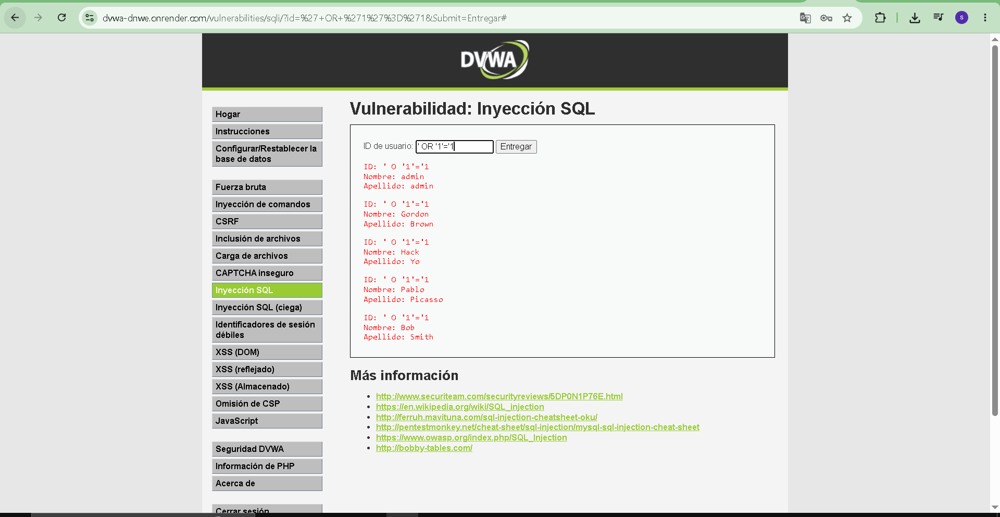

# 02 - Inyección SQL

## Descripción del hallazgo

Se identificó una vulnerabilidad de Inyección SQL en el portal de clientes de SuperMax. El sistema construye consultas SQL concatenando directamente la entrada del usuario, lo que permite manipular la lógica de la consulta.

## Evidencia del ataque



*Figura 1. Ejecucion propia de SQL Injection en DVWA (portal auditado): se ingresa el payload y se obtiene respuesta con multiples registros de clientes.*

## Payload

```sql
' OR '1'='1
```

## Impacto

Este payload permite obtener acceso no autorizado a datos de la base de datos de clientes de fidelización, incluyendo saldos de puntos, historial de compras y credenciales en formato hash. SuperMax corre el riesgo de exfiltración masiva de información confidencial.

## Por que funciona tecnicamente

La consulta vulnerable concatena la entrada del usuario dentro del WHERE sin usar parametros. El payload convierte la condicion en siempre verdadera y anula el filtro por ID.

Ejemplo simplificado:

```sql
SELECT * FROM clientes WHERE id = '' OR '1'='1';
```

Resultado: el motor SQL devuelve muchos registros en lugar de uno.

## CVSS 3.1

- Puntaje: 8.2
- Severidad: Alta

## Puntaje de riesgo de negocio (Matriz)

- Probabilidad: 4/5
- Impacto: 4/5
- Resultado: 16/25 (Alto)

### Justificacion del puntaje

- La explotacion es simple y repetible con un payload conocido.
- El activo afectado es critico para SuperMax: base de clientes y fidelizacion.
- La exfiltracion puede comprometer datos masivos con impacto legal y reputacional.

## Politica de prevencion (3.1.4)

- Implementar Consultas Parametrizadas (Prepared Statements) en todas las consultas SQL.
- Separar el codigo SQL de los datos de entrada del cliente.
- Validar y sanitizar las entradas antes de enviarlas al backend.

## Control de mitigacion (3.1.5)

- Activar monitoreo y alertas de consultas anomalas y errores SQL para detectar intentos de inyeccion.
- Restringir privilegios del usuario de base de datos (minimo privilegio) para reducir impacto en caso de explotacion.
- Implementar WAF con reglas de deteccion de patrones SQLi como capa compensatoria.

Referencia de marco: OWASP ASVS (V5 Validation, Sanitization and Encoding), OWASP Top 10 2021 A03 Injection, NIST SP 800-53 SI-10.
