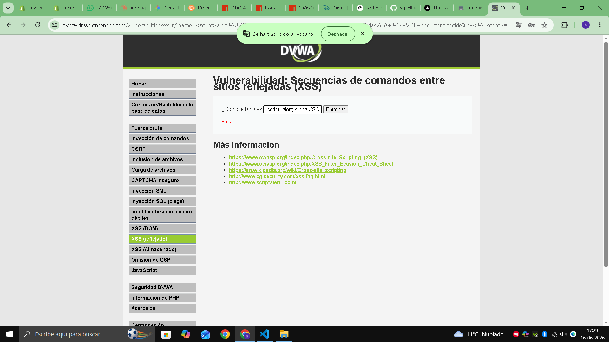

# 03 - XSS Reflejado

## Descripción del hallazgo

Se detectó vulnerabilidad de Cross-Site Scripting (XSS) reflejado en el portal de SuperMax. El sistema devuelve contenido generado por el usuario sin escapado adecuado, permitiendo la ejecución de scripts en el navegador de la víctima.

## Evidencia del ataque



*Figura 2. Ejecucion propia de XSS Reflejado en DVWA: el payload se refleja y ejecuta JavaScript en el navegador de la victima.*

## Payload

```js
alert('XSS')
```

## Impacto

Un atacante puede robar sesiones activas de los clientes de SuperMax, obtener cookies de autenticación y suplantar identidades. Esto facilita el acceso no autorizado a cuentas de fidelización y a datos personales.

## Por que funciona tecnicamente

La aplicacion inserta en HTML la entrada del usuario sin escape contextual. El navegador interpreta el contenido como codigo en lugar de texto.

Ejemplo simplificado:

```html
<div>Hola, <script>alert('XSS')</script></div>
```

Resultado: se ejecuta JavaScript en el contexto de la sesion del usuario.

## CVSS 3.1

- Puntaje: 6.1
- Severidad: Media

## Puntaje de riesgo de negocio (Matriz)

- Probabilidad: 3/5
- Impacto: 3/5
- Resultado: 9/25 (Medio)

### Justificacion del puntaje

- Requiere interaccion del usuario (abrir enlace manipulado), por eso la probabilidad no es maxima.
- Permite secuestro de sesion y suplantacion de identidad sobre cuentas de clientes.
- El dano de negocio es relevante, pero menos amplio que SQLi o comando sobre servidor.

## Politica de prevencion (3.1.4)

- Escapar y codificar toda salida de datos de usuario en la interfaz.
- Implementar una Politica de Seguridad de Contenido (CSP) estricta.
- Validar y sanitizar entradas antes de mostrarlas en el navegador.

## Control de mitigacion (3.1.5)

- Configurar cookies de sesion con HttpOnly, Secure y SameSite para reducir riesgo de robo de sesion.
- Implementar monitoreo de eventos anormales de sesion (cambio brusco de IP/User-Agent).
- Aplicar WAF con reglas para payloads XSS comunes como control compensatorio.

Referencia de marco: OWASP ASVS (V5, V14), OWASP Top 10 2021 A03 Injection, NIST SP 800-53 SI-10 y AU-6.
