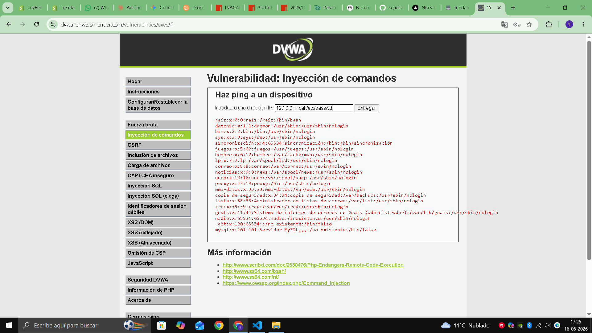

# 04 - Inyección de Comandos

## Descripción del hallazgo

El portal de SuperMax presenta una vulnerabilidad de Command Injection que permite ejecutar comandos en el servidor subyacente cuando la entrada del usuario no se valida correctamente.

## Evidencia del ataque



*Figura 3. Ejecucion propia de Command Injection en DVWA: el payload concatena un comando del sistema y expone contenido de archivos del servidor.*

## Payload

```bash
127.0.0.1; cat /etc/passwd
```

## Impacto

El atacante puede obtener control total del servidor web, exfiltrar archivos sensibles, y comprometer la infraestructura de la aplicación. Esto impacta directamente la disponibilidad y la seguridad operativa del portal.

## Por que funciona tecnicamente

La aplicacion ejecuta comandos de sistema concatenando directamente la entrada del usuario. Al usar metacaracteres de shell (;), el atacante encadena comandos arbitrarios.

Ejemplo simplificado:

```bash
ping <entrada_usuario>
```

Con entrada maliciosa:

```bash
127.0.0.1; cat /etc/passwd
```

Resultado: se ejecuta ping y luego lectura de archivos locales.

## CVSS 3.1

- Puntaje: 9.8
- Severidad: Crítica

## Puntaje de riesgo de negocio (Matriz)

- Probabilidad: 4/5
- Impacto: 5/5
- Resultado: 20/25 (Critico)

### Justificacion del puntaje

- El vector es facil de ejecutar cuando existe concatenacion directa de entradas.
- El atacante puede leer archivos del sistema y escalar a compromiso de infraestructura.
- Afecta simultaneamente confidencialidad, integridad y disponibilidad del portal.

## Politica de prevencion (3.1.4)

- Aplicar listas blancas de comandos permitidos.
- Usar APIs seguras que no invoquen comandos del sistema directamente.
- Ejecutar procesos con el menor privilegio posible.

## Control de mitigacion (3.1.5)

- Aislar el servicio en contenedor o sandbox para limitar movimiento lateral.
- Implementar EDR/antimalware de servidor y alertas por ejecucion de comandos no esperados.
- Habilitar registro centralizado y respuesta a incidentes para contener compromiso del host.

Referencia de marco: OWASP ASVS (V10 Malicious Code), OWASP Top 10 2021 A03 Injection, NIST SP 800-53 SI-4 e IR-4.
